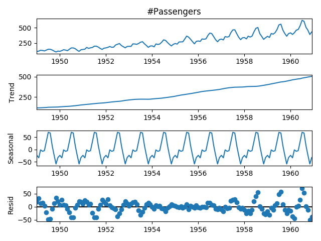
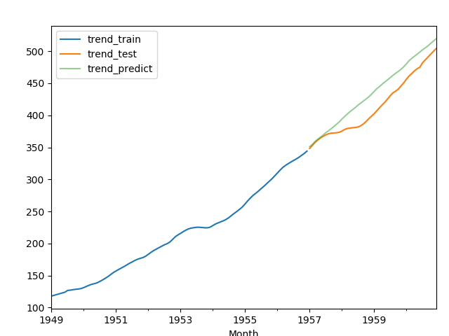
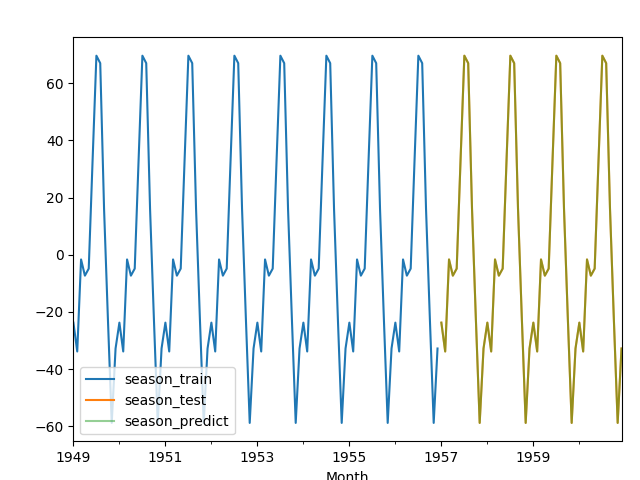
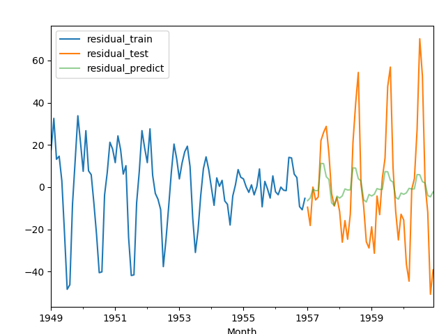
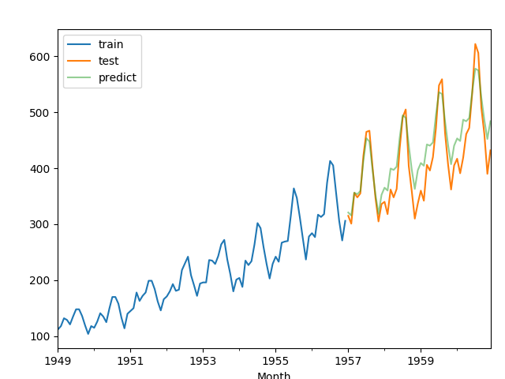
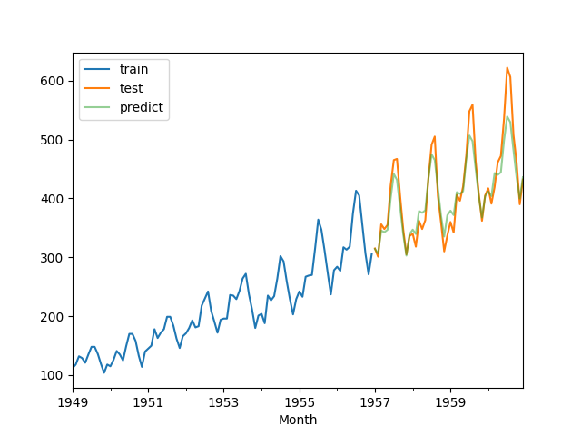

####Background
TSFrame is a  python project used for univariate time series forecasting. 

#####Models:

* decompose model: STL, RobustSTL, X11
* forecasting model: Arima, Holt, Prophet

#####Modes:

* decompose
  * decompose the data into three components: trend, seasonal and residual
  * model each component separately
  * aggregate the results as the final prediction
* no decompose
  * model the data directly

#####Features:

* in-sample & out-of-sample predictions
* decompose & no decompose results
* different models for different components (e.g., holt for trend, arima for seasonal, prophet for residual)
* easy to extend for more models

#### Quick Start

```shell
python main.py
```

#### Usage

Refr to [Config.py](Config.py) for the docs on how to change the default parameters for your own time series forecasting task.

#### Examples

Use the default parameters provided in [Config.py](Config.py)

#####Decompose Mode

* Decompose result 

  

* trend prediction

  

* seasonal prediction

  

* residual prediction

  

* final prediction

  

#####No Decompose Mode


